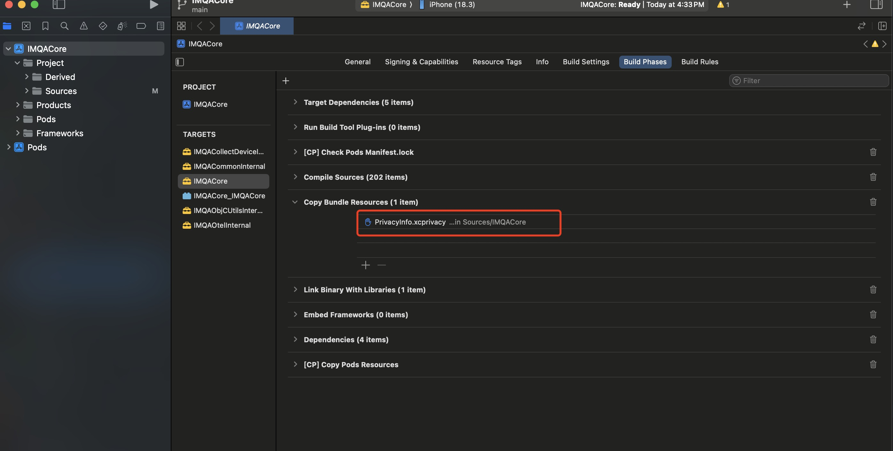

# Project setup
## 아래 shell문서를 실행해주세요
```sh
./setup.sh
```

==🔴처음에 시작할때 아래와 같이해주세요. tuist를 아무리 수정해도 staticLibrary는 PrivacyInfo.xcprivacy를 copy할수 없나봐요.==

## 빌드시 아래 shell문서 실행해주세요. 
```sh
./build.sh
```
### Build의 xcframework 폴더에 xcframework가 생성됨

### project에 넣고 쓰시면 됩니다. 

